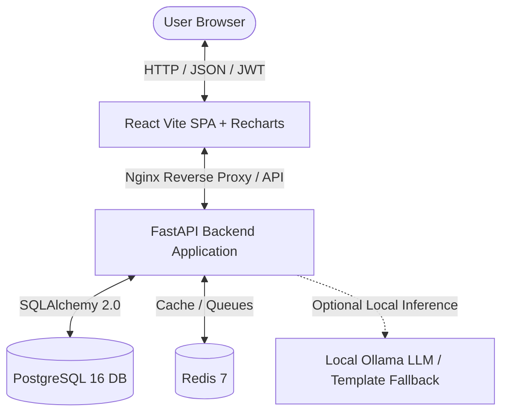

# 🛡️ AegisFinance: AI-Powered Personal Finance & Financial Risk Agent

[](https://github.com/your-username/finance-risk-agent/actions)
[](LICENSE)
[](https://www.python.org/)
[](https://fastapi.tiangolo.com)
[](https://react.dev)
[](https://www.docker.com)
[]()

A complete, production-grade, self-hosted web application for personal cash flow telemetry, statistical anomaly detection, cash flow forecasting, and financial risk grading. Built with **100% free and open-source tools** — requires **zero paid API keys** and **no third-party auth services**.

---

## 📸 Key Features

1. **Flexible CSV Statement Ingestion**: Auto-detects and parses banking exports from Chase, Bank of America, Wells Fargo, Citi, or custom spreadsheets with support for multiple date and currency formats.
2. **Deterministic Rule-Based Categorization**: High-speed keyword mapping across 10 major spending categories with fallback to "Uncategorized" and inline user override.
3. **Recurring Obligation Detection**: Identifies recurring subscriptions, utility bills, and paychecks by analyzing interval cadences (weekly, biweekly, monthly) and flags silent price hikes (e.g., Netflix subscription jumping 25%).
4. **Statistical Anomaly Detection**: Category-aware **Interquartile Range (IQR)** and **Z-score** ($|z| \ge 2.5$) outlier detection to highlight unexpected expense spikes.
5. **Cash Flow & Balance Forecasting**: 30-to-60-day moving average cash burn projections anchored with scheduled recurring obligations and statistical confidence bands ($\pm 1.96 \sigma \sqrt{t}$).
6. **Financial Risk Score Engine (0–100)**: Evaluates emergency runway buffer (months of essential living expenses), spending volatility ($CV = \frac{\sigma}{\mu}$), and net savings rate into an actionable risk classification.
7. **Savings Goals Tracking**: Real-time progress bars, completion timelines, and required monthly contributions.
8. **AI Risk Advisory**: Connects to a local **Ollama** LLM (e.g. `llama3.2`) for personalized advice, with an automatic, graceful fallback to rich template-based explanations when Ollama is offline.
9. **Human-Approval Workflow & Audit Trail**: Recommendations strictly require explicit user confirmation before being marked as acted on or dismissed; all decisions are permanently preserved in an immutable database audit log.

---

## 🏛️ System Architecture



---

## 🚀 Quickstart in 3 Minutes (Docker Compose)

### Prerequisites
- [Docker](https://docs.docker.com/get-docker/) & [Docker Compose](https://docs.docker.com/compose/) installed on your machine.
- Git.

### 1. Clone & Setup Environment
```bash
git clone https://github.com/your-username/finance-risk-agent.git
cd finance-risk-agent
cp .env.example .env
```

### 2. Launch Stack with One Command
```bash
docker-compose up --build
```

That's it! Docker spins up:
- **Frontend SPA**: [http://localhost:3000](http://localhost:3000)
- **FastAPI Backend**: [http://localhost:8000](http://localhost:8000)
- **Interactive OpenAPI Docs**: [http://localhost:8000/docs](http://localhost:8000/docs)
- **PostgreSQL Database**: Port `5432`
- **Redis Cache**: Port `6379`

### 3. Log In with Pre-Seeded Demo Data
The application automatically seeds a realistic 6-month financial history on initial startup:
- **Email**: `demo@example.com`
- **Password**: `password123`

*(You can also click the **"Load Demo Account Credentials"** button on the login screen).*

---

## 💻 Local Development (Without Docker)

You can run the entire application directly on your local machine using SQLite:

### Backend Setup
```bash
cd backend
python -m venv venv

# Windows:
.\venv\Scripts\activate
# Linux/macOS:
source venv/bin/activate

pip install -r requirements.txt
uvicorn app.main:app --reload --port 8000
```
> The backend automatically creates an SQLite database `finance.db` and loads the sample dataset if no database URL is set.

### Frontend Setup
```bash
cd frontend
npm install
npm run dev
```
Open [http://localhost:3000](http://localhost:3000) (or `http://localhost:5173`).

---

## 🧪 Running Automated Tests

The test suite covers categorization, recurring subscription detection, IQR anomaly detection, cash flow forecasting, and financial risk score calculation:

```bash
cd backend
pytest tests/ -v
```

Output:
```text
tests/test_anomaly.py::test_detect_statistical_outlier PASSED
tests/test_anomaly.py::test_anomaly_ignores_income_inflows PASSED
tests/test_categorization.py::test_categorize_common_merchants PASSED
tests/test_categorization.py::test_categorize_income PASSED
tests/test_categorization.py::test_categorize_fallback_uncategorized PASSED
tests/test_categorization.py::test_merchant_extraction_cleans_noise PASSED
tests/test_forecasting.py::test_forecast_empty_transactions PASSED
tests/test_forecasting.py::test_forecast_projection_length_and_bounds PASSED
tests/test_forecasting.py::test_forecast_with_recurring_obligations PASSED
tests/test_recurring.py::test_detect_monthly_recurring_and_price_spike PASSED
tests/test_risk.py::test_risk_score_healthy_finances PASSED
tests/test_risk.py::test_risk_score_vulnerable_finances PASSED
```

---

## 📂 Project Structure

```
finance-risk-agent/
├── .github/
│   └── workflows/
│       └── ci.yml                # GitHub Actions: test and lint backend & frontend
├── backend/
│   ├── alembic/                  # Database schema migrations
│   ├── app/
│   │   ├── api/                  # FastAPI routers (auth, ingestion, analytics, etc.)
│   │   ├── core/                 # Config, database session, JWT security
│   │   ├── db/                   # Table initialization & realistic seed data
│   │   ├── models/               # SQLAlchemy ORM models
│   │   ├── schemas/              # Pydantic v2 schemas
│   │   ├── services/             # Core engines: categorizer, anomaly, forecast, risk, LLM
│   │   └── main.py               # FastAPI application entrypoint & CORS
│   ├── tests/                    # Pytest automated test suite
│   ├── Dockerfile
│   └── requirements.txt
├── frontend/
│   ├── src/
│   │   ├── components/           # Reusable UI widgets: StatCard, RiskGauge, Modal, Navbar
│   │   ├── context/              # Authentication context provider
│   │   ├── pages/                # Dashboard, Transactions, Upload, Analytics, Goals, Recommendations
│   │   ├── services/             # Axios API client wrapper
│   │   ├── App.jsx
│   │   └── main.jsx
│   ├── Dockerfile
│   ├── nginx.conf
│   └── package.json
├── sample_data/
│   └── transactions_sample.csv   # 6-month realistic statement to test upload & detection
├── .env.example                  # Environment configuration template
├── docker-compose.yml            # Multi-container orchestration (Postgres, Redis, Backend, Frontend)
└── README.md
```

---

## 🧠 Optional Local LLM (Ollama)

To enable offline AI explanations using Ollama:
1. Install [Ollama](https://ollama.ai/) on your host machine.
2. Pull your model of choice:
   ```bash
   ollama pull llama3.2
   ```
3. Run Ollama:
   ```bash
   ollama serve
   ```
4. In `docker-compose.yml` or `.env`, set `OLLAMA_BASE_URL=http://host.docker.internal:11434`.
5. If Ollama is unavailable, the application **automatically uses high-quality deterministic fallback explanations** with zero latency and zero downtime.

---

## 🔒 Security & Privacy Notice
- **Zero Third-Party Telemetry**: Your banking and transaction data never leaves your infrastructure.
- **Passlib & BCrypt**: Password hashes use industry-standard salting with bcrypt.
- **Signed JWT Tokens**: Authentication uses secure SHA-256 tokens stored locally in the browser.

---

## 📄 License
This project is open-source software licensed under the [MIT License](LICENSE).
